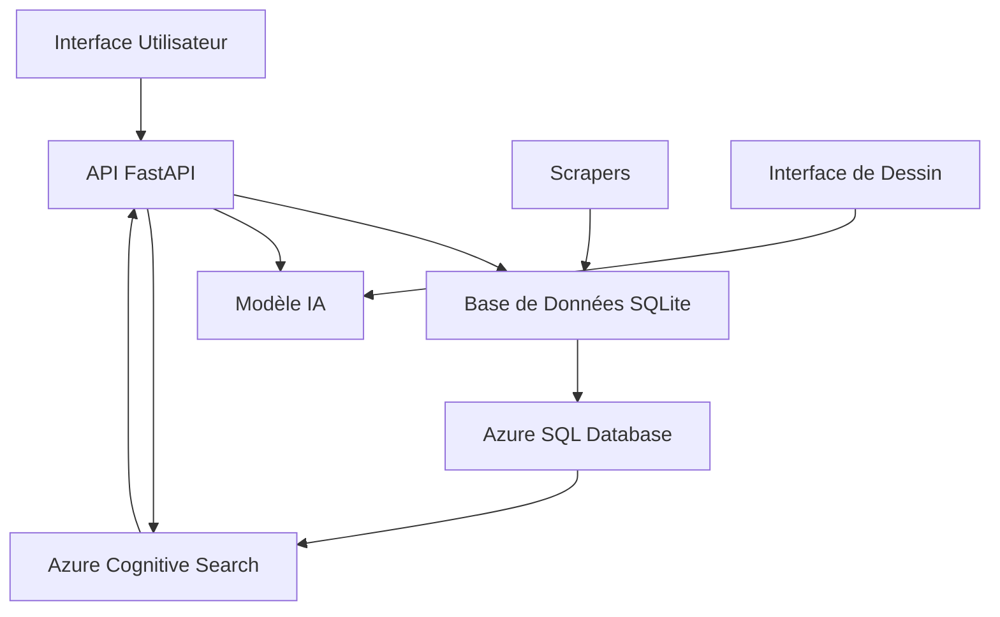

# EngraveDetect - Documentation Technique

## Vue d'Ensemble
EngraveDetect est une solution complète de détection et gestion des gravures de verres optiques, combinant une API REST, un système de reconnaissance par deep learning, une base de données SQLite avec synchronisation Azure SQL, et un moteur de recherche avancé basé sur Azure Cognitive Search.

### 1.1 Vue d'Ensemble


### 1.2 Flux de Données
1. **Acquisition des Données**
   - Scraping des sites fournisseurs
   - Stockage dans SQLite local
   - Synchronisation avec Azure SQL

2. **Synchronisation Cloud**
   - Migration des données vers Azure SQL
   - Indexation dans Azure Cognitive Search
   - Mise à jour automatique des index

3. **Recherche et Accès**
   - Recherche full-text via Azure Search
   - Filtrage et facettes sur les attributs
   - Cache et optimisation des requêtes

## Architecture Système

### Composants Principaux
```
engravedetect/
├── api/                    # API REST FastAPI
│   ├── routes/            # Points d'entrée de l'API
│   ├── auth/              # Authentification JWT
│   ├── dependencies/      # Dépendances FastAPI
│   └── tests/             # Tests unitaires et d'intégration
├── database/              # Gestion base de données
│   ├── config/           # Configuration SQLAlchemy
│   ├── models/           # Modèles SQLAlchemy
│   ├── scripts/          # Scripts d'import/export
│   │   └── azure_sync/   # Scripts de synchronisation Azure
│   └── tests/            # Tests unitaires
├── model/                 # Système de reconnaissance
│   ├── dataset/          # Données d'entraînement
│   ├── models/           # Modèles entraînés
│   ├── templates/        # Templates de référence
│   └── tests/            # Tests unitaires
└── scrapers/             # Collecte de données
    ├── spiders/          # Spiders Scrapy
    └── pipelines/        # Traitement des données
```

## Spécifications Techniques

### Environnement d'Exécution
- Python 3.8+
- OS Support: Windows, Linux, macOS
- RAM Minimale: 4GB
- Espace Disque: 1GB+
- ODBC Driver 18 pour SQL Server

### Dépendances Principales
```
fastapi>=0.100.0
uvicorn>=0.23.0
sqlalchemy>=2.0.0
python-dotenv>=1.0.0
azure-search-documents>=11.4.0
azure-core>=1.26.0
azure-common>=1.1.28
pyodbc>=4.0.39
```

### Base de Données
- SQLite 3.31+ (développement)
- Azure SQL Database (production)
- ORM: SQLAlchemy 2.0+
- Schéma: 10 tables principales
- Indexation: B-tree sur clés primaires
- Synchronisation bidirectionnelle

### Moteur de Recherche
- Azure Cognitive Search
- Index personnalisé pour les verres
- Recherche full-text et filtres
- Facettes sur fournisseurs et matériaux
- Scoring basé sur la pertinence

### API REST
- Framework: FastAPI 0.100+
- Authentication: JWT
- Documentation: OpenAPI 3.0
- Rate Limiting: 180s entre indexations
- Timeout: 30s

## Métriques de Performance

### Base de Données
- Temps de requête moyen: <50ms
- Taille actuelle: ~100MB
- Synchronisation Azure: ~5min
- Backup: Automatique quotidien

### Moteur de Recherche
- Temps de réponse: <200ms
- Précision recherche: >90%
- Limite indexation: 180s
- Taille index: <1GB

## Sécurité

### Protection des Données
- Variables d'environnement pour les credentials
- Authentification Azure managée
- TLS 1.2+ pour les connexions
- Validation des entrées

### Audit
- Logs de synchronisation
- Traçabilité des indexations
- Monitoring Azure
- Alertes d'erreurs

## Déploiement

### Prérequis Système
```bash
# Dépendances système
apt-get install python3.8 python3.8-dev
apt-get install sqlite3 libsqlite3-dev
apt-get install unixodbc-dev

# Environnement virtuel
python -m venv venv
source venv/bin/activate
pip install -r requirements.txt
```

### Configuration
```bash
# Variables d'environnement
cp .env.example .env
# Configuration requise:
# - AZURE_SEARCH_ENDPOINT
# - AZURE_SEARCH_KEY
# - AZURE_SQL_CONNECTION_STRING

# Synchronisation
python database/scripts/azure_sync/sync_schema_and_data.py
python database/scripts/azure_sync/create_search_index.py
python database/scripts/azure_sync/index_data.py
```

### Tests
```bash
# Tests de synchronisation
python database/scripts/azure_sync/test_search.py
```

## Maintenance

### Tâches Régulières
- Synchronisation Azure SQL: Quotidienne
- Réindexation Search: Au besoin
- Vérification des logs: Quotidienne
- Backup SQLite: Hebdomadaire

### Monitoring
- Azure Monitor
- Logs d'application
- Métriques de recherche
- Alertes d'erreurs

## Support

### Documentation
- README.md: Vue d'ensemble
- TECHNICAL_DOCUMENTATION.md: Détails techniques
- database/README.md: Documentation BDD
- Commentaires dans le code

### Contact
- Issues GitHub
- Documentation en ligne
- Support technique Azure

## Licence et Crédits
- Licence: MIT
- Version: 1.0.0
- Copyright: 2024

