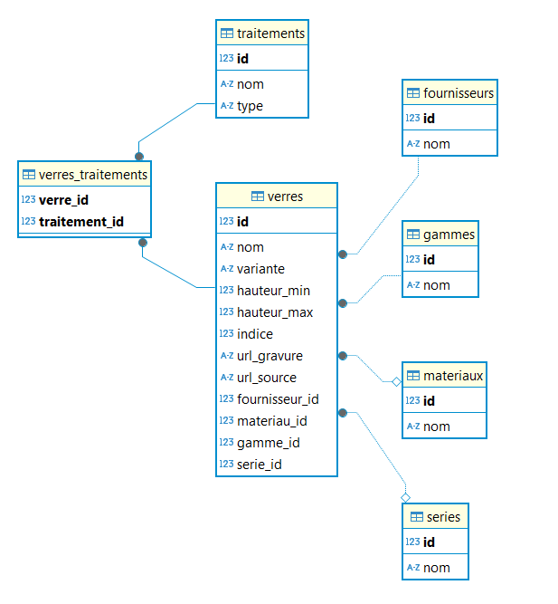

# EngraveDetect

## Description

EngraveDetect est un projet conçu pour gérer et analyser les données liées aux verres optiques, y compris les fournisseurs, matériaux, gammes, séries, traitements, et verres eux-mêmes. Il utilise FastAPI pour fournir une API RESTful permettant d'interagir avec une base de données SQLite.

## Fonctionnalités

- **Gestion des fournisseurs** : Créer, lire, mettre à jour et supprimer des fournisseurs.
- **Gestion des matériaux** : Créer, lire, mettre à jour et supprimer des matériaux.
- **Gestion des gammes** : Créer, lire, mettre à jour et supprimer des gammes.
- **Gestion des séries** : Créer, lire, mettre à jour et supprimer des séries.
- **Gestion des traitements** : Créer, lire, mettre à jour et supprimer des traitements.
- **Gestion des verres** : Lire les informations détaillées sur les verres, y compris leurs traitements associés.

## Installation

1. Clonez le dépôt :
   ```bash
   git clone https://github.com/votre-utilisateur/engravedetect.git
   cd engravedetect
   ```

2. Créez un environnement virtuel et activez-le :
   ```bash
   python -m venv venv
   source venv/bin/activate  # Sur Windows, utilisez `venv\Scripts\activate`
   ```

3. Installez les dépendances :
   ```bash
   pip install -r requirements.txt
   ```

4. Initialisez la base de données :
   ```bash
   bash database/setup_db.sh
   ```

5. Importez les données initiales :
   ```bash
   python database/scripts/import_data.py
   ```

## Utilisation

1. Lancez le serveur FastAPI :
   ```bash
   uvicorn api.main:app --reload
   ```

2. Accédez à la documentation interactive de l'API à l'adresse [http://localhost:8000/docs](http://localhost:8000/docs).

## Structure du Projet

- `api/`: Contient les routes de l'API et les dépendances.
- `database/`: Contient la configuration de la base de données, les modèles et les scripts d'initialisation.
- `requirements.txt`: Liste des dépendances Python nécessaires au projet.

## Schéma de la Base de Données



### Tables principales

- **verres**: Table centrale contenant les informations des verres optiques
- **fournisseurs**: Référentiel des fournisseurs
- **materiaux**: Types de matériaux utilisés
- **gammes**: Gammes de produits
- **series**: Séries de produits
- **traitements**: Types de traitements disponibles
- **verres_traitements**: Table de liaison entre verres et traitements

### Relations

- Un verre appartient à un fournisseur (1:N)
- Un verre peut avoir un matériau (1:N)
- Un verre appartient à une gamme (1:N)
- Un verre peut appartenir à une série (1:N)
- Un verre peut avoir plusieurs traitements (N:N)

## Contribution

Les contributions sont les bienvenues ! Veuillez soumettre une pull request ou ouvrir une issue pour discuter des changements que vous souhaitez apporter.

## Licence

Ce projet est sous licence MIT. Voir le fichier [LICENSE](LICENSE) pour plus de détails.

## Contact

Pour toute question ou suggestion concernant ce projet, veuillez contacter l'équipe de développement.

# Documentation du Projet de Scraping de Verres Optiques

## 1. Vue d'ensemble du projet

### Objectif
Le projet vise à collecter et structurer les données des verres optiques de différents fournisseurs via le site france-optique.com. Ces données sont essentielles pour maintenir une base de données à jour des produits optiques disponibles sur le marché français.

### Architecture technique
- **Language**: Python
- **Framework principal**: Scrapy
- **Base de données**: SQLite
- **Structure des données**: Format CSV pour l'import, SQLite pour le stockage
- **Organisation**: Architecture en couches (spiders, pipelines, data cleaning)

## 2. Structure de la Base de Données

### Schéma de la Base de Données


### Tables principales
- **verres**: Table centrale contenant les informations des verres optiques
- **fournisseurs**: Référentiel des fournisseurs
- **materiaux**: Types de matériaux utilisés
- **gammes**: Gammes de produits
- **series**: Séries de produits
- **traitements**: Types de traitements disponibles
- **verres_traitements**: Table de liaison entre verres et traitements

### Relations
- Un verre appartient à un fournisseur (1:N)
- Un verre peut avoir un matériau (1:N)
- Un verre appartient à une gamme (1:N)
- Un verre peut appartenir à une série (1:N)
- Un verre peut avoir plusieurs traitements (N:N)

### Structure détaillée des tables

#### Table verres
- `id`: Identifiant unique (PK)
- `nom`: Nom du verre
- `variante`: Variante du verre (nullable)
- `hauteur_min`: Hauteur minimale (nullable)
- `hauteur_max`: Hauteur maximale (nullable)
- `indice`: Indice de réfraction (nullable)
- `url_gravure`: URL de la gravure (nullable)
- `url_source`: URL source (nullable)
- `fournisseur_id`: Référence au fournisseur (FK)
- `materiau_id`: Référence au matériau (FK, nullable)
- `gamme_id`: Référence à la gamme (FK)
- `serie_id`: Référence à la série (FK, nullable)

#### Table traitements
- `id`: Identifiant unique (PK)
- `nom`: Nom du traitement
- `type`: Type de traitement ('protection' ou 'photochromique')

#### Table fournisseurs
- `id`: Identifiant unique (PK)
- `nom`: Nom du fournisseur (unique)

#### Table materiaux
- `id`: Identifiant unique (PK)
- `nom`: Nom du matériau (unique)

#### Table gammes
- `id`: Identifiant unique (PK)
- `nom`: Nom de la gamme (unique)

#### Table series
- `id`: Identifiant unique (PK)
- `nom`: Nom de la série (unique)

#### Table verres_traitements
- `verre_id`: Référence au verre (PK, FK)
- `traitement_id`: Référence au traitement (PK, FK)

## 3. Structure des données

### Format des fichiers
scrapers/
├── datalake/
│ ├── staging/
│ │ └── data/
│ └── enhanced/
│ └── data/

## 4. Installation et Configuration

### Prérequis
- Python 3.8+
- pip
- virtualenv (recommandé)
- DBeaver (ou autre client SQL) pour explorer la base de données

### Installation
#Créer un environnement virtuel
python -m venv venv

# Activer l'environnement virtuel
source venv/bin/activate  # Linux/Mac
venv\Scripts\activate     # Windows

# Installer les dépendances
pip install -r requirements.txt
```

### Exécution
```bash
# Lancer un spider spécifique
scrapy crawl glass_spider

# Lancer tous les spiders
python scrapers/run_all_spiders.py
```

## 9. Contribution
1. Fork le projet
2. Créer une branche pour votre fonctionnalité
3. Commiter vos changements
4. Pousser vers la branche
5. Ouvrir une Pull Request

## 10. Licence
Ce projet est sous licence privée. Tous droits réservés.

## 11. Contact
Pour toute question ou suggestion concernant ce projet, veuillez contacter l'équipe de développement.


