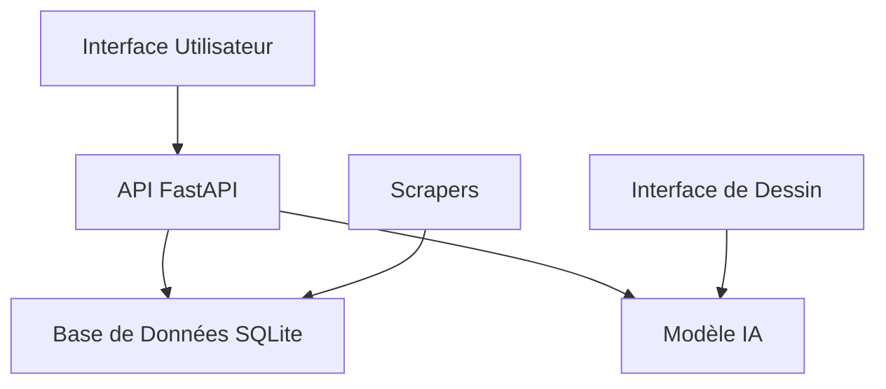

# Documentation Technique Exhaustive - EngraveDetect

## Table des Matières
1. [Architecture Système](#1-architecture-système)
2. [Modèle de Détection IA](#2-modèle-de-détection-ia)
3. [API et Backend](#3-api-et-backend)
4. [Base de Données](#4-base-de-données)
5. [Système de Scraping](#5-système-de-scraping)
6. [Infrastructure et Déploiement](#6-infrastructure-et-déploiement)
7. [Synchronisation Azure et Moteur de Recherche](#7-synchronisation-azure-et-moteur-de-recherche)

## 1. Architecture Système

### 1.1 Vue d'Ensemble


### 1.2 Flux de Données
1. **Acquisition des Données**
   - Scraping des sites fournisseurs
   - Stockage des images de symboles
   - Normalisation et prétraitement

2. **Traitement des Symboles**
   - Détection via réseau siamois
   - Calcul des scores de confiance
   - Stockage des résultats

3. **Validation et Feedback**
   - Interface utilisateur de validation
   - Mise à jour des scores
   - Enrichissement des templates

## 2. Modèle de Détection IA

### 2.1 Architecture du Réseau Siamois
```python
class SiameseNetwork(nn.Module):
    def __init__(self):
        super().__init__()
        # Couches de convolution pour l'extraction de caractéristiques
        self.conv = nn.Sequential(
            # Première couche : 1 canal -> 64 filtres
            nn.Conv2d(1, 64, 10),  # Sortie: 64x55x55
            nn.ReLU(inplace=True),
            nn.MaxPool2d(2),       # Sortie: 64x27x27
            
            # Deuxième couche : 64 -> 128 filtres
            nn.Conv2d(64, 128, 7), # Sortie: 128x21x21
            nn.ReLU(inplace=True),
            nn.MaxPool2d(2),       # Sortie: 128x10x10
            
            # Troisième couche : 128 -> 128 filtres
            nn.Conv2d(128, 128, 4),# Sortie: 128x7x7
            nn.ReLU(inplace=True),
            nn.MaxPool2d(2)        # Sortie: 128x3x3
        )
        
        # Couches fully connected pour la comparaison
        self.fc = nn.Sequential(
            nn.Linear(128 * 3 * 3, 512),
            nn.ReLU(inplace=True),
            nn.Linear(512, 512),
            nn.ReLU(inplace=True),
            nn.Linear(512, 128)    # Embedding final
        )

    def forward_once(self, x):
        # Passage dans les couches de convolution
        x = self.conv(x)
        # Aplatissement
        x = x.view(x.size(0), -1)
        # Passage dans les couches fully connected
        x = self.fc(x)
        return x

    def forward(self, input1, input2):
        # Obtention des embeddings pour chaque image
        output1 = self.forward_once(input1)
        output2 = self.forward_once(input2)
        return output1, output2
```

### 2.2 Prétraitement des Images
```python
def preprocess_image(image: Image.Image) -> torch.Tensor:
    # 1. Conversion en niveaux de gris
    gray_image = image.convert("L")
    
    # 2. Binarisation adaptative
    img_array = np.array(gray_image)
    threshold = np.mean(img_array)
    binary = (img_array > threshold).astype(np.uint8) * 255
    
    # 3. Redimensionnement avec préservation du ratio
    target_size = 64
    w, h = binary.shape
    if w > h:
        new_w = target_size
        new_h = int((h * target_size) / w)
    else:
        new_h = target_size
        new_w = int((w * target_size) / h)
    
    # 4. Padding pour obtenir une image carrée
    padded = np.full((target_size, target_size), 255, dtype=np.uint8)
    x_offset = (target_size - new_w) // 2
    y_offset = (target_size - new_h) // 2
    padded[y_offset:y_offset+new_h, x_offset:x_offset+new_w] = binary
    
    # 5. Normalisation et conversion en tensor
    tensor = torch.from_numpy(padded).float()
    tensor = tensor.unsqueeze(0) / 255.0  # Ajout dimension canal
    tensor = (tensor - 0.5) / 0.5  # Normalisation [-1, 1]
    
    return tensor
```

### 2.3 Entraînement Détaillé
```python
class ContrastiveLoss(nn.Module):
    def __init__(self, margin=2.0):
        super(ContrastiveLoss, self).__init__()
        self.margin = margin

    def forward(self, output1, output2, label):
        # Distance euclidienne entre les embeddings
        euclidean_distance = F.pairwise_distance(output1, output2)
        # Loss pour les paires similaires et dissimilaires
        loss_contrastive = torch.mean((1-label) * torch.pow(euclidean_distance, 2) +
                                    (label) * torch.pow(torch.clamp(self.margin - euclidean_distance, min=0.0), 2))
        return loss_contrastive

def train_model(train_loader, model, criterion, optimizer, num_epochs=100):
    # Configuration de l'entraînement
    device = torch.device("cuda" if torch.cuda.is_available() else "cpu")
    model = model.to(device)
    best_loss = float('inf')
    patience = 10
    patience_counter = 0
    
    for epoch in range(num_epochs):
        model.train()
        running_loss = 0.0
        
        for i, (img1, img2, label) in enumerate(train_loader):
            img1, img2, label = img1.to(device), img2.to(device), label.to(device)
            
            # Forward pass
            output1, output2 = model(img1, img2)
            loss = criterion(output1, output2, label)
            
            # Backward pass
            optimizer.zero_grad()
            loss.backward()
            optimizer.step()
            
            running_loss += loss.item()
            
        epoch_loss = running_loss / len(train_loader)
        
        # Early stopping
        if epoch_loss < best_loss:
            best_loss = epoch_loss
            patience_counter = 0
            torch.save({
                'epoch': epoch,
                'model_state_dict': model.state_dict(),
                'optimizer_state_dict': optimizer.state_dict(),
                'loss': epoch_loss,
            }, 'best_model.pth')
        else:
            patience_counter += 1
            if patience_counter >= patience:
                print(f"Early stopping at epoch {epoch}")
                break
```

### 2.4 Inférence et Détection
```python
class SymbolDetector:
    def __init__(self, model_path: str, threshold: float = 0.65):
        self.device = torch.device("cuda" if torch.cuda.is_available() else "cpu")
        self.model = SiameseNetwork().to(self.device)
        self.load_model(model_path)
        self.threshold = threshold
        self.templates = self.load_templates()

    def load_model(self, path: str):
        checkpoint = torch.load(path, map_location=self.device)
        self.model.load_state_dict(checkpoint['model_state_dict'])
        self.model.eval()

    def load_templates(self):
        templates = {}
        template_dir = Path("model/templates")
        for symbol_dir in template_dir.iterdir():
            if symbol_dir.is_dir():
                template_path = symbol_dir / "template.png"
                if template_path.exists():
                    img = Image.open(template_path)
                    tensor = preprocess_image(img).to(self.device)
                    templates[symbol_dir.name] = tensor
        return templates

    def detect(self, image: Image.Image) -> Dict[str, float]:
        # Prétraitement de l'image d'entrée
        input_tensor = preprocess_image(image).to(self.device)
        
        results = {}
        with torch.no_grad():
            for symbol_name, template_tensor in self.templates.items():
                # Obtention des embeddings
                output1 = self.model.forward_once(input_tensor)
                output2 = self.model.forward_once(template_tensor)
                
                # Calcul de la similarité
                distance = F.pairwise_distance(output1, output2)
                similarity = 1 - (distance.item() / 2.0)  # Normalisation [0, 1]
                
                if similarity >= self.threshold:
                    results[symbol_name] = similarity
        
        return dict(sorted(results.items(), key=lambda x: x[1], reverse=True))
```

## 3. API et Backend

### 3.1 Structure FastAPI Détaillée
```python
# Configuration principale
app = FastAPI(
    title="EngraveDetect API",
    description="API de détection et gestion des symboles de verres",
    version="1.0.0",
    docs_url="/docs",
    redoc_url="/redoc",
    openapi_url="/openapi.json"
)

# Middleware
app.add_middleware(
    CORSMiddleware,
    allow_origins=["*"],
    allow_credentials=True,
    allow_methods=["*"],
    allow_headers=["*"],
)

# Rate limiting
limiter = Limiter(key_func=get_remote_address)
app.state.limiter = limiter

@app.middleware("http")
async def add_process_time_header(request: Request, call_next):
    start_time = time.time()
    response = await call_next(request)
    process_time = time.time() - start_time
    response.headers["X-Process-Time"] = str(process_time)
    return response
```

### 3.2 Modèles Pydantic
```python
class SymboleBase(BaseModel):
    nom: str
    description: Optional[str] = None

    class Config:
        orm_mode = True

class SymboleCreate(SymboleBase):
    pass

class Symbole(SymboleBase):
    id: int
    created_at: datetime
    updated_at: datetime

class VerreSymboleCreate(BaseModel):
    verre_id: int
    symbole_id: int
    score_confiance: float = Field(..., ge=0, le=1)
    est_valide: bool = False

class VerreSymboleUpdate(BaseModel):
    est_valide: bool
    valide_par: str
```

### 3.3 Routes API Détaillées
```python
# Routes Symboles
@router.get("/symboles/", response_model=List[Symbole])
async def get_symboles(
    skip: int = Query(0),
    limit: int = Query(100),
    search: Optional[str] = None,
    db: Session = Depends(get_db),
    current_user: str = Depends(verify_auth)
):
    """
    Récupère la liste des symboles avec pagination et recherche.
    Paramètres:
        - skip: Nombre d'éléments à sauter
        - limit: Nombre maximum d'éléments à retourner
        - search: Terme de recherche optionnel
    """
    query = db.query(SymboleTag)
    if search:
        query = query.filter(SymboleTag.nom.ilike(f"%{search}%"))
    return query.offset(skip).limit(limit).all()

@router.post("/verres/{verre_id}/symboles/")
async def create_verre_symbole(
    verre_id: int,
    association: VerreSymboleCreate,
    db: Session = Depends(get_db),
    current_user: str = Depends(verify_auth)
):
    """
    Crée une nouvelle association verre-symbole.
    Validation:
        - Vérifie l'existence du verre et du symbole
        - Vérifie l'unicité de l'association
        - Valide le score de confiance
    """
    # Implémentation détaillée...
```

## 4. Base de Données

### 4.1 Schéma Détaillé
```sql
-- Table des symboles
CREATE TABLE symboles_tags (
    id INTEGER PRIMARY KEY AUTOINCREMENT,
    nom VARCHAR(500) NOT NULL UNIQUE,
    description TEXT,
    created_at TIMESTAMP DEFAULT CURRENT_TIMESTAMP,
    updated_at TIMESTAMP DEFAULT CURRENT_TIMESTAMP
);

-- Table des associations verres-symboles
CREATE TABLE verres_symboles (
    id INTEGER PRIMARY KEY AUTOINCREMENT,
    verre_id INTEGER NOT NULL,
    symbole_id INTEGER NOT NULL,
    score_confiance FLOAT NOT NULL CHECK(score_confiance >= 0 AND score_confiance <= 1),
    est_valide BOOLEAN DEFAULT FALSE,
    valide_par VARCHAR(100),
    created_at TIMESTAMP DEFAULT CURRENT_TIMESTAMP,
    updated_at TIMESTAMP DEFAULT CURRENT_TIMESTAMP,
    FOREIGN KEY (verre_id) REFERENCES verres(id) ON DELETE CASCADE,
    FOREIGN KEY (symbole_id) REFERENCES symboles_tags(id) ON DELETE CASCADE,
    UNIQUE (verre_id, symbole_id)
);

-- Index pour optimisation des performances
CREATE INDEX idx_verres_symboles_verre_id ON verres_symboles(verre_id);
CREATE INDEX idx_verres_symboles_symbole_id ON verres_symboles(symbole_id);
CREATE INDEX idx_verres_symboles_score ON verres_symboles(score_confiance);
```

### 4.2 Migrations Alembic
```python
"""create_symboles_tables

Revision ID: a1b2c3d4e5f6
Revises: 
Create Date: 2024-01-01 12:00:00.000000
"""
from alembic import op
import sqlalchemy as sa

def upgrade():
    # Création table symboles
    op.create_table(
        'symboles_tags',
        sa.Column('id', sa.Integer(), nullable=False),
        sa.Column('nom', sa.String(length=500), nullable=False),
        sa.Column('description', sa.Text(), nullable=True),
        sa.Column('created_at', sa.DateTime(), server_default=sa.text('CURRENT_TIMESTAMP')),
        sa.Column('updated_at', sa.DateTime(), server_default=sa.text('CURRENT_TIMESTAMP')),
        sa.PrimaryKeyConstraint('id'),
        sa.UniqueConstraint('nom')
    )

    # Création table associations
    op.create_table(
        'verres_symboles',
        sa.Column('id', sa.Integer(), nullable=False),
        # ... autres colonnes
    )

def downgrade():
    op.drop_table('verres_symboles')
    op.drop_table('symboles_tags')
```

### 4.3 Gestion des Sessions
```python
from contextlib import contextmanager
from sqlalchemy.orm import sessionmaker
from database.config.database import engine

SessionLocal = sessionmaker(autocommit=False, autoflush=False, bind=engine)

@contextmanager
def get_db():
    db = SessionLocal()
    try:
        yield db
        db.commit()
    except Exception:
        db.rollback()
        raise
    finally:
        db.close()
```

## 5. Système de Scraping

### 5.1 Architecture des Spiders
```python
class GlassSpider(scrapy.Spider):
    name = 'glass_spider'
    custom_settings = {
        'CONCURRENT_REQUESTS': 16,
        'DOWNLOAD_DELAY': 1.0,
        'ROBOTSTXT_OBEY': True,
        'USER_AGENT': 'EngraveDetect Bot v1.0'
    }

    def start_requests(self):
        urls = [
            'https://fournisseur1.com/verres',
            'https://fournisseur2.com/catalogue'
        ]
        for url in urls:
            yield scrapy.Request(url=url, callback=self.parse)

    def parse(self, response):
        # Extraction des données
        for verre in response.css('.verre-item'):
            yield {
                'nom': verre.css('.nom::text').get(),
                'reference': verre.css('.ref::text').get(),
                'url_gravure': verre.css('img::attr(src)').get(),
                'fournisseur': response.meta.get('fournisseur'),
                'date_extraction': datetime.now().isoformat()
            }

        # Pagination
        next_page = response.css('.next::attr(href)').get()
        if next_page:
            yield response.follow(next_page, self.parse)
```

### 5.2 Pipeline de Traitement
```python
class DataProcessingPipeline:
    def __init__(self):
        self.session = SessionLocal()

    def process_item(self, item, spider):
        # Nettoyage et validation des données
        cleaned_item = self.clean_data(item)
        if not self.validate_data(cleaned_item):
            raise DropItem(f"Données invalides: {item}")

        # Téléchargement et traitement de l'image
        if cleaned_item.get('url_gravure'):
            image_path = self.download_image(cleaned_item['url_gravure'])
            cleaned_item['image_locale'] = image_path

        # Création ou mise à jour en base
        try:
            self.save_to_database(cleaned_item)
            self.session.commit()
        except Exception as e:
            self.session.rollback()
            raise DropItem(f"Erreur base de données: {str(e)}")

        return cleaned_item

    def clean_data(self, item):
        return {
            'nom': item['nom'].strip(),
            'reference': item['reference'].strip() if item.get('reference') else None,
            'url_gravure': self.normalize_url(item.get('url_gravure')),
            'fournisseur': item['fournisseur'],
            'date_extraction': parse(item['date_extraction'])
        }

    def validate_data(self, item):
        required_fields = ['nom', 'fournisseur']
        return all(item.get(field) for field in required_fields)

    def normalize_url(self, url):
        if not url:
            return None
        return urljoin(self.base_url, url)

    def download_image(self, url):
        response = requests.get(url, stream=True)
        if response.status_code == 200:
            file_path = f"images/{uuid.uuid4()}.jpg"
            with open(file_path, 'wb') as f:
                for chunk in response.iter_content(1024):
                    f.write(chunk)
            return file_path
        return None
```

### 5.3 Configuration et Exécution
```python
# settings.py
SPIDER_MODULES = ['scrapers.spiders']
NEWSPIDER_MODULE = 'scrapers.spiders'
ITEM_PIPELINES = {
    'scrapers.pipelines.DataProcessingPipeline': 300,
    'scrapers.pipelines.ImagesPipeline': 200
}
IMAGES_STORE = 'data/images'
DOWNLOAD_DELAY = 1.0
CONCURRENT_REQUESTS = 16
LOG_LEVEL = 'INFO'

# Exécution programmée
from scrapy.crawler import CrawlerProcess
from scrapy.utils.project import get_project_settings

def run_spiders():
    settings = get_project_settings()
    process = CrawlerProcess(settings)
    
    # Ajout des spiders
    process.crawl(GlassSpider)
    process.crawl(GlassSpiderParticular)
    
    # Démarrage du processus
    process.start()

if __name__ == '__main__':
    run_spiders()
```

## 6. Infrastructure et Déploiement

### 6.1 Architecture Docker
```dockerfile
# api/Dockerfile
FROM python:3.10-slim

WORKDIR /app

# Installation des dépendances système
RUN apt-get update && apt-get install -y \
    build-essential \
    libsqlite3-dev \
    && rm -rf /var/lib/apt/lists/*

# Installation des dépendances Python
COPY api/requirements.txt .
RUN pip install --no-cache-dir -r requirements.txt

# Copie du code source
COPY api/ ./api/
COPY database/ ./database/
COPY model/ ./model/

ENV PYTHONPATH=/app
ENV PYTHONUNBUFFERED=1

EXPOSE 8000

CMD ["uvicorn", "api.main:app", "--host", "0.0.0.0", "--port", "8000"]
```

### 6.2 Configuration Docker Compose
```yaml
version: '3.8'

services:
  api:
    build:
      context: .
      dockerfile: api/Dockerfile
    restart: always
    ports:
      - "8001:8000"
    environment:
      - DATABASE_URL=sqlite:///app/database/data/verres.db
      - JWT_SECRET_KEY=${JWT_SECRET_KEY}
      - JWT_ALGORITHM=${JWT_ALGORITHM}
      - JWT_ACCESS_TOKEN_EXPIRE_MINUTES=${JWT_ACCESS_TOKEN_EXPIRE_MINUTES}
      - ADMIN_USERNAME=${ADMIN_USERNAME}
      - ADMIN_PASSWORD=${ADMIN_PASSWORD}
    volumes:
      - ./database/data:/app/database/data
      - ./model:/app/model
    networks:
      - engravedetect-network

  redis:
    image: redis:6-alpine
    restart: always
    volumes:
      - redis_data:/data
    networks:
      - engravedetect-network

  nginx:
    image: nginx:alpine
    restart: always
    ports:
      - "80:80"
      - "443:443"
    volumes:
      - ./nginx/conf.d:/etc/nginx/conf.d
      - ./nginx/ssl:/etc/nginx/ssl
      - ./nginx/www:/var/www/html
    depends_on:
      - api
    networks:
      - engravedetect-network

volumes:
  redis_data:

networks:
  engravedetect-network:
    driver: bridge
```

### 6.3 Monitoring et Logging

#### 6.3.1 Configuration Prometheus
```yaml
global:
  scrape_interval: 15s
  evaluation_interval: 15s

scrape_configs:
  - job_name: 'engravedetect'
    static_configs:
      - targets: ['api:8000']
    metrics_path: '/metrics'
```

#### 6.3.2 Configuration Grafana
```json
{
  "dashboard": {
    "title": "EngraveDetect API Monitoring",
    "panels": [
      {
        "title": "Requêtes par minute",
        "type": "graph",
        "datasource": "Prometheus",
        "targets": [
          {
            "expr": "rate(http_requests_total[1m])",
            "legendFormat": "{{method}} {{path}}"
          }
        ]
      },
      {
        "title": "Temps de réponse",
        "type": "graph",
        "datasource": "Prometheus",
        "targets": [
          {
            "expr": "rate(http_request_duration_seconds_sum[1m]) / rate(http_request_duration_seconds_count[1m])",
            "legendFormat": "{{path}}"
          }
        ]
      }
    ]
  }
}
```

### 6.4 Sécurité et SSL

#### 6.4.1 Configuration Nginx avec SSL
```nginx
server {
    listen 443 ssl;
    server_name engravedetect.com;

    ssl_certificate /etc/nginx/ssl/engravedetect.crt;
    ssl_certificate_key /etc/nginx/ssl/engravedetect.key;
    ssl_protocols TLSv1.2 TLSv1.3;
    ssl_ciphers HIGH:!aNULL:!MD5;

    location / {
        proxy_pass http://api:8000;
        proxy_set_header Host $host;
        proxy_set_header X-Real-IP $remote_addr;
        proxy_set_header X-Forwarded-For $proxy_add_x_forwarded_for;
        proxy_set_header X-Forwarded-Proto $scheme;
    }
}
```

#### 6.4.2 Script de Génération SSL
```bash
#!/bin/bash
# generate_ssl.sh

openssl genrsa -out nginx/ssl/engravedetect.key 2048
openssl req -new -key nginx/ssl/engravedetect.key \
    -out nginx/ssl/engravedetect.csr \
    -subj "/C=FR/ST=IDF/L=Paris/O=EngraveDetect/CN=engravedetect.com"
openssl x509 -req -days 365 \
    -in nginx/ssl/engravedetect.csr \
    -signkey nginx/ssl/engravedetect.key \
    -out nginx/ssl/engravedetect.crt
```

### 6.5 Sauvegarde et Restauration

#### 6.5.1 Script de Backup Automatique
```python
#!/usr/bin/env python3
import datetime
import os
import shutil
import subprocess

def backup_database():
    """Sauvegarde la base de données SQLite."""
    timestamp = datetime.datetime.now().strftime("%Y%m%d_%H%M%S")
    backup_dir = "backups/database"
    os.makedirs(backup_dir, exist_ok=True)
    
    db_path = "database/data/verres.db"
    backup_path = f"{backup_dir}/verres_{timestamp}.db"
    
    subprocess.run([
        "sqlite3",
        db_path,
        f".backup '{backup_path}'"
    ])
    
    shutil.make_archive(backup_path, 'gzip', backup_dir)

def backup_model():
    """Sauvegarde les modèles ML et templates."""
    timestamp = datetime.datetime.now().strftime("%Y%m%d_%H%M%S")
    backup_dir = "backups/model"
    os.makedirs(backup_dir, exist_ok=True)
    
    shutil.make_archive(
        f"{backup_dir}/model_{timestamp}",
        'gzip',
        "model"
    )

if __name__ == "__main__":
    backup_database()
    backup_model()
```

### 6.6 CI/CD Pipeline

#### 6.6.1 Configuration GitHub Actions
```yaml
name: CI/CD Pipeline

on:
  push:
    branches: [ "dev", "main" ]
  pull_request:
    branches: [ "dev", "main" ]

jobs:
  test:
    runs-on: ubuntu-latest
    steps:
    - uses: actions/checkout@v4
    - name: Set up Python
      uses: actions/setup-python@v4
      with:
        python-version: "3.10"
    - name: Install dependencies
      run: |
        python -m pip install --upgrade pip
        pip install -r api/requirements.txt
        pip install pytest pytest-cov
    - name: Run tests
      env:
        JWT_SECRET_KEY: ${{ secrets.JWT_SECRET_KEY }}
        ADMIN_USERNAME: ${{ secrets.ADMIN_USERNAME }}
        ADMIN_PASSWORD: ${{ secrets.ADMIN_PASSWORD }}
      run: |
        pytest tests/ --cov=./ --cov-report=xml

  deploy:
    needs: test
    if: github.ref == 'refs/heads/main'
    runs-on: ubuntu-latest
    steps:
    - name: Deploy to production
      env:
        DEPLOY_KEY: ${{ secrets.DEPLOY_KEY }}
      run: |
        echo "Déploiement en production..."
```

## 7. Synchronisation Azure et Moteur de Recherche

### 7.1 Architecture Globale

#### 7.1.1 Composants Azure
- Azure SQL Database : Stockage principal des données
- Azure Cognitive Search : Moteur de recherche
- Azure Storage : Stockage des fichiers binaires (images, etc.)

#### 7.1.2 Structure du Projet
```
database/
├── scripts/
│   └── azure_sync/
│       ├── create_search_index.py    # Création de l'index de recherche
│       ├── index_data.py            # Indexation des données
│       ├── test_search.py           # Tests de recherche
│       └── sync_schema_and_data.py  # Synchronisation SQL
```

### 7.2 Synchronisation avec Azure SQL

#### 7.2.1 Configuration de la Base de Données
```python
# Configuration Azure SQL
SERVER = 'adventureworks-server-hdf.database.windows.net'
DATABASE = 'engravedetect-db'
USERNAME = 'jvcb'
DRIVER = '{ODBC Driver 18 for SQL Server}'
```

#### 7.2.2 Processus de Synchronisation
1. Suppression des tables existantes
2. Création du nouveau schéma
3. Migration des données
4. Création des index et contraintes

#### 7.2.3 Tables Synchronisées
- fournisseurs
- materiaux
- gammes
- series
- traitements
- verres
- symboles
- verres_symboles
- verres_traitements
- gravures

### 7.3 Configuration Azure Cognitive Search

#### 7.3.1 Création de l'Index
```python
# Configuration
SEARCH_ENDPOINT = "https://engravedetect-search.search.windows.net"
INDEX_NAME = "verres-index"
```

#### 7.3.2 Structure de l'Index
```python
fields = [
    SimpleField(name="id", type=SearchFieldDataType.String, key=True),
    SearchableField(name="nom", type=SearchFieldDataType.String, 
                   searchable=True, filterable=True, sortable=True),
    # ... autres champs
]
```

#### 7.3.3 Relations et Champs Complexes
- Fournisseur (relation one-to-one)
- Matériau (relation one-to-one)
- Gamme (relation one-to-one)
- Série (relation one-to-one)
- Symboles (relation many-to-many)
- Traitements (relation many-to-many)

### 7.4 Indexation des Données

#### 7.4.1 Source de Données
```sql
SELECT 
    CAST(v.id as NVARCHAR(50)) as id,
    v.nom,
    v.variante,
    -- ... autres champs
FROM verres v
LEFT JOIN fournisseurs f ON v.fournisseur_id = f.id
-- ... autres jointures
```

#### 7.4.2 Configuration de l'Indexeur
```python
indexer = SearchIndexer(
    name="verres-indexer",
    data_source_name="azure-sql-verres",
    target_index_name="verres-index",
    parameters={
        "batchSize": 1000,
        "maxFailedItems": 0
    }
)
```

#### 7.4.3 Limitations
- Délai de 180 secondes entre les exécutions manuelles de l'indexeur
- Taille maximale des documents : 16 MB
- Limite de champs : 1000 par index

### 7.5 Fonctionnalités de Recherche

#### 7.5.1 Recherche Basique
```python
results = search_verres(
    client, 
    query="essilor",
    select=["nom", "variante", "fournisseur"]
)
```

#### 7.5.2 Recherche Filtrée
```python
results = search_verres(
    client,
    query="*",
    filter="indice ge 1.5",
    order_by=["indice desc"]
)
```

#### 7.5.3 Recherche avec Facettes
```python
results = search_verres(
    client,
    query="*",
    facets=["fournisseur/nom"],
    top=0
)
```

### 7.6 Variables d'Environnement (.env)
```
AZURE_SEARCH_ENDPOINT=https://engravedetect-search.search.windows.net
AZURE_SEARCH_KEY=<votre_clé>
AZURE_SQL_CONNECTION_STRING=Server=...;Database=...;User Id=...;Password=...
```

### 7.7 Bonnes Pratiques

#### 7.7.1 Sécurité
- Utilisation de variables d'environnement pour les clés
- Authentification Azure avec identités gérées
- Chiffrement TLS pour les connexions

#### 7.7.2 Performance
- Indexation par lots (batch size: 1000)
- Sélection minimale des champs dans les requêtes
- Utilisation de facettes pour les agrégations

#### 7.7.3 Maintenance
- Surveillance des erreurs d'indexation
- Vérification régulière de la synchronisation
- Gestion des timeouts et des limites de requêtes

### 7.8 Tests et Validation

#### 7.8.1 Tests de Recherche
- Recherche textuelle simple
- Filtrage par critères
- Agrégations et facettes

#### 7.8.2 Validation des Données
- Vérification de l'intégrité des relations
- Contrôle des doublons
- Validation des formats de données

### 7.9 Dépendances

#### 7.9.1 Python
```
azure-search-documents>=11.4.0
azure-core>=1.26.0
azure-common>=1.1.28
pyodbc>=4.0.39
python-dotenv
```

#### 7.9.2 Système
- ODBC Driver 18 for SQL Server
- Python 3.8+
- Accès réseau aux services Azure

### 7.10 Résolution des Problèmes

#### 7.10.1 Problèmes Courants
1. Timeout de connexion
   - Vérifier les paramètres réseau
   - Augmenter les timeouts

2. Erreurs d'indexation
   - Vérifier les logs d'indexeur
   - Respecter les délais entre les exécutions

3. Erreurs de recherche
   - Vérifier la syntaxe des filtres
   - Valider les paramètres de facettes

#### 7.10.2 Monitoring
- Surveillance des métriques Azure
- Logs d'indexation
- Suivi des performances de recherche

Cette documentation technique détaillée couvre tous les aspects de l'infrastructure et du déploiement d'EngraveDetect, fournissant les configurations et scripts nécessaires pour une mise en production robuste et sécurisée. 