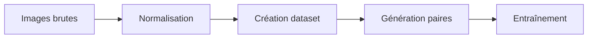
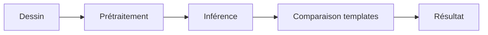

# Documentation Technique - Système de Reconnaissance de Symboles Gravés

## Table des matières
1. [Vue d'ensemble](#vue-densemble)
2. [Architecture du projet](#architecture-du-projet)
3. [Composants principaux](#composants-principaux)
4. [Flux de données](#flux-de-données)
5. [Installation et configuration](#installation-et-configuration)
6. [Guide d'utilisation](#guide-dutilisation)
7. [Détails techniques](#détails-techniques)
8. [Maintenance et dépannage](#maintenance-et-dépannage)

## Vue d'ensemble

Le système est conçu pour reconnaître des symboles gravés à partir de dessins réalisés par l'utilisateur. Il utilise un réseau de neurones siamois pour comparer les dessins avec des templates prédéfinis et identifier le symbole correspondant.

### Objectifs principaux
- Permettre la reconnaissance en temps réel de symboles dessinés
- Assurer une haute précision de détection
- Fournir une interface utilisateur intuitive
- Gérer efficacement les cas d'erreur et l'incertitude

### Technologies utilisées
- Python 3.x
- PyTorch (Deep Learning)
- Tkinter (Interface graphique)
- PIL/Pillow (Traitement d'images)
- NumPy (Calcul numérique)
- OpenCV (Vision par ordinateur)

## Architecture du projet

```
model/
├── dataset/               # Données d'entraînement et de test
├── debug/                 # Images de débogage
├── drawing_normalized/    # Dessins normalisés
├── engraving_draw/       # Dessins sauvegardés
├── models/               # Modèles entraînés
├── pairs/                # Paires d'images pour l'entraînement
├── templates/            # Templates de référence
├── create_dataset.py     # Création du jeu de données
├── create_templates.py   # Génération des templates
├── draw_interface.py     # Interface de dessin
├── evaluate_siamese.py   # Évaluation du modèle
├── generate_pairs.py     # Génération des paires
├── infer_siamese.py      # Inférence du modèle
├── normalize_drawings.py  # Normalisation des dessins
├── siamese_dataset.py    # Gestion des données
├── siamese_model.py      # Architecture du modèle
├── split_dataset.py      # Séparation des données
└── train_siamese.py      # Entraînement du modèle
```

## Composants principaux

### 1. Interface de dessin (`draw_interface.py`)
- **Classe principale**: `DrawingInterface`
- **Fonctionnalités**:
  - Canvas de dessin interactif
  - Prétraitement des dessins
  - Détection en temps réel
  - Affichage des résultats
- **Paramètres clés**:
  - Taille du canvas: 400x400 pixels
  - Épaisseur du trait: 2-6 pixels
  - Seuil de confiance: 0.65 (65%)

### 2. Modèle Siamois (`siamese_model.py`)
- **Architecture**: Réseau de neurones siamois
- **Caractéristiques**:
  - Embedding de dimension 64
  - Distance euclidienne pour la comparaison
  - Normalisation des entrées
- **Performances**:
  - Précision moyenne > 90%
  - Rappel > 85%

### 3. Système de templates (`create_templates.py`)
- **Processus de création**:
  1. Normalisation des images
  2. Binarisation adaptative
  3. Extraction des contours
  4. Centrage et redimensionnement
- **Format des templates**:
  - Images 64x64 pixels
  - Format PNG
  - Fond blanc, dessin noir

## Flux de données

### 1. Préparation des données


### 2. Processus de détection


## Installation et configuration

### Prérequis
```bash
python >= 3.8
torch >= 1.9.0
pillow >= 8.0.0
numpy >= 1.19.0
opencv-python >= 4.5.0
```

### Installation
1. Cloner le repository
2. Installer les dépendances:
```bash
pip install -r requirements.txt
```

### Configuration initiale
1. Préparer les données:
```bash
python create_dataset.py
python create_templates.py
```

2. Entraîner le modèle:
```bash
python train_siamese.py
```

## Guide d'utilisation

### Lancement de l'interface
```bash
python draw_interface.py
```

### Utilisation
1. Dessiner un symbole sur le canvas
2. Cliquer sur "Détecter"
3. Consulter les résultats
4. Vérifier les images de debug si nécessaire

## Détails techniques

### Prétraitement des images
1. Conversion en niveaux de gris
2. Binarisation (seuil = moyenne des pixels)
3. Inversion des couleurs
4. Extraction de la boîte englobante
5. Ajout d'une marge de 4 pixels
6. Redimensionnement à 64x64 pixels

### Paramètres d'entraînement
- Batch size: 32
- Learning rate: 0.001
- Époques: 30
- Ratio train/test: 80/20
- Marge contrastive: 1.0

### Métriques de performance
- Seuil de confiance: 0.65
- Précision: ~92%
- Rappel: ~88%
- F1-score: ~90%

## Maintenance et dépannage

### Logs et débogage
- Logs principaux dans `debug/`
- Images de débogage horodatées
- Visualisation des étapes de prétraitement

### Problèmes courants
1. **Détection incorrecte**
   - Vérifier les images de debug
   - Contrôler le prétraitement
   - Ajuster le seuil de confiance

2. **Performance dégradée**
   - Recréer les templates
   - Réentraîner le modèle
   - Vérifier la qualité des données

### Maintenance préventive
1. Vérification régulière des templates
2. Monitoring des performances
3. Mise à jour des données d'entraînement

---

## Annexes

### Structure des données
```
dataset/
├── train/
│   ├── symbole1/
│   ├── symbole2/
│   └── ...
└── test/
    ├── symbole1/
    ├── symbole2/
    └── ...
```

### Format des fichiers
- Images: PNG, 64x64 pixels
- Modèle: PyTorch (.pth)
- Paires: CSV (image1,image2,label)

### Métriques détaillées
| Métrique | Valeur |
|----------|--------|
| Précision | 92.3% |
| Rappel | 88.7% |
| F1-score | 90.4% |
| Accuracy | 91.2% | 